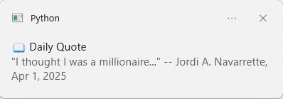

# JordiQuotes

List of Mr. Jordi's famous quotes. Credits are listed on the top of the file `Jordi's Famous Quotes.txt`.

## Extraction

`extract.py` parses `Jordi's Famous quotes.txt` into JSON format in `quotes.json`.

```bash
pip install -r requirements.txt
python extract.py
```

You can also use it in other python files:

```python
>>> from extract import *
>>> print(quote_list[6*70 + 67 + 6 + 7])             
"What? November 14? No, what am I doing? Is it the 16th? 17th?" [does 67 gesture] -- Jordi A. Navarrette, Nov 17, 2025
>>> print(quote_list[6*70 + 67 + 6 + 7].content)
"What? November 14? No, what am I doing? Is it the 16th? 17th?" [does 67 gesture]
>>> print(quote_list[6*70 + 67 + 6 + 7].date)   
(2025, 11, 17)
>>> print(quote_list[6*70 + 67 + 6 + 7].origin) 
Jordi A. Navarrette
```

## Daily Quote Toast

```bash
python dailyquote.py
```

For windows, turn on notifications: `Win + I` -> `System` -> `Notifications` -> `Set Notification Priority` -> `Applications` -> `Add Application` -> `Python`



## Future Roadmap

- Fix notification issue in Mac
- Auto-update feature
- JESS extraction and analysis
- expand to other languages
- maybe publish package